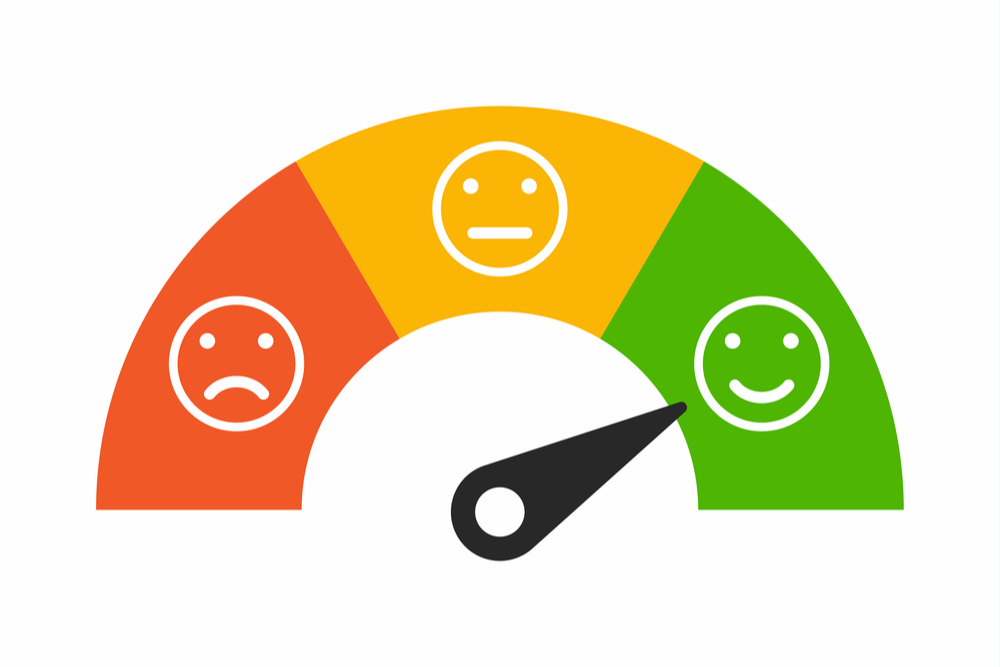

# VibeCheck: YouTube Comment Sentiment Analyzer

VibeCheck is a full-stack ML application that analyzes YouTube comments with local TensorFlow models. It fetches video metadata and comments through the YouTube Data API, classifies each comment as positive, neutral, or negative, adjusts for sarcasm, and presents the results in a polished React dashboard.



## Highlights

- React and Material UI dashboard with loading, validation, error, metric, chart, and comment-review states.
- Flask API that fetches YouTube video metadata and top-level comments.
- Local TensorFlow sentiment model with a custom attention layer: `python-backend/model_1.h5`.
- Local TensorFlow sarcasm model: `python-backend/new_model_sarcasm.h5`.
- Local tokenizer artifact: `python-backend/tokenizer.pkl`.
- Weighted 0-10 video sentiment score based on model rating, recency, and engagement.
- Docker and Docker Compose support for local deployment.

## Tech Stack

- Frontend: React, Vite, Material UI, Recharts, Axios
- Backend: Flask, Flask-CORS, YouTube Data API v3
- Machine learning: TensorFlow/Keras, GRU attention sentiment model, sarcasm classifier
- Deployment: Docker, Docker Compose

## Project Structure

```text
yt-comment-analyzer/
  frontend/          React dashboard
  python-backend/    Flask API and local ML model artifacts
  docker-compose.yml
```

## Setup

Create `python-backend/.env`:

```bash
DEVELOPER_KEY=your_youtube_data_api_key
```

Install and run the backend:

```bash
cd python-backend
pip install -r requirements.txt
python app.py
```

Install and run the frontend:

```bash
cd frontend
npm install
npm run dev
```

Open the frontend URL printed by Vite, usually `http://localhost:5173`.

## Docker

```bash
docker-compose up --build
```

## Environment Variables

Frontend:

```bash
VITE_API_BASE_URL=http://127.0.0.1:5000
```

Backend:

```bash
DEVELOPER_KEY=your_youtube_data_api_key
PORT=5000
```

## API

`POST /analyze`

Request:

```json
{
  "youtubeLink": "https://www.youtube.com/watch?v=VIDEO_ID"
}
```

Response:

```json
{
  "video_details": {
    "video_title": "Video title",
    "channel_name": "Channel name",
    "view_count": "1000",
    "like_count": "100",
    "thumbnail_url": "https://..."
  },
  "analyzed_comments": [
    {
      "comment": "Great video",
      "num_of_likes": 12,
      "timestamp": "2026-01-01T00:00:00Z",
      "sentiment": "positive",
      "rating": 0.94
    }
  ]
}
```

